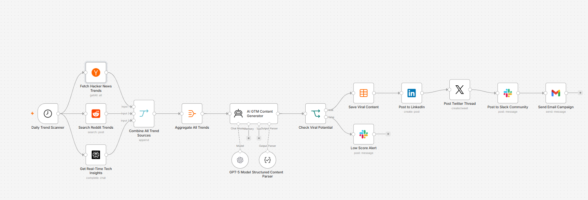

  # TrendForge AI 🚀

AI-powered n8n workflow that discovers trending AI and developer topics, generates viral GTM content using AI, scores its viral potential, and automatically distributes it across LinkedIn, Twitter/X, Slack, and Email.

Perfect for:
- AI Automation Engineers
- GTM Engineers
- Developer Marketers
- Content Automation Agencies
- Personal Branding Systems

---

# 🖼 Workflow Diagram



---

# ✨ Features

- 🔍 Real-time trend discovery
- 🤖 AI-generated viral content
- 📊 Viral scoring system
- 🚀 Automated publishing pipeline
- 🧠 Multi-platform GTM automation
- 💾 Content storage with Data Tables
- ⚠️ Low-score alerting system
- ⏰ Runs automatically every 6 hours

---

# 🏗 Architecture Overview

```text
Schedule Trigger
      ↓
Trend Collection Layer
(Hacker News + Reddit + Perplexity)
      ↓
Trend Aggregation
      ↓
AI Content Generation
(OpenAI Agent)
      ↓
Structured Output Parser
      ↓
Viral Score Validation
      ↓
 ┌───────────────┴───────────────┐
 │                               │
High Viral Score          Low Viral Score
 │                               │
Auto Publish              Slack Alert
 │
 ├── LinkedIn
 ├── Twitter/X
 ├── Slack
 └── Email Campaign
```

---

# ⚙️ Workflow Breakdown

## 1. Schedule Trigger

Runs every 6 hours automatically.

### Purpose
Continuously monitor AI, automation, and developer trends in real-time.

---

## 2. Trend Collection

The workflow collects trends from multiple high-signal sources.

### 📰 Hacker News
Fetches:
- Front-page stories
- Startup launches
- Developer discussions
- AI tool announcements

### 💬 Reddit
Searches:
- r/programming
- r/technology
- r/artificial
- r/MachineLearning

Keywords:
- AI automation
- Workflow automation
- Developer tools
- GTM systems

### 🔎 Perplexity AI
Collects:
- Viral AI discussions
- GitHub trends
- Product launches
- Emerging tools
- Tech ecosystem updates

---

# 🤖 AI Content Generation

Using OpenAI + LangChain Agent, the workflow generates:

## LinkedIn Post
- Hook-based storytelling
- Thought leadership positioning
- CTA optimized
- Hashtags included

## Twitter/X Thread
- 5-tweet viral thread
- Educational format
- Engagement optimized

## Slack Announcement
- Community-friendly messaging
- Quick updates format

## Email Campaign
- Subject line generation
- GTM-focused messaging
- Newsletter-style content

## GitHub Repo Description
- Portfolio-ready summaries
- Technical positioning

---

# 📊 Viral Scoring System

AI evaluates generated content and assigns a viral score.

| Viral Score | Action |
|---|---|
| > 70 | Auto-publish |
| ≤ 70 | Send Slack alert for review |

---

# 🚀 Publishing Pipeline

If the content passes the viral threshold:

✅ Save to n8n Data Table  
✅ Publish to LinkedIn  
✅ Publish Twitter/X Thread  
✅ Post to Slack Community  
✅ Send Email Campaign  

If the score is too low:

⚠️ Slack alert sent for manual review.

---

# 🧰 Tech Stack

- n8n
- OpenAI
- LangChain
- Hacker News API
- Reddit API
- Perplexity API
- LinkedIn API
- Slack API
- Gmail API
- Twitter/X API

---

# 📦 Required Credentials

Configure these credentials inside n8n:

| Service | Required |
|---|---|
| OpenAI API | ✅ |
| Reddit OAuth2 | ✅ |
| LinkedIn OAuth2 | ✅ |
| Slack API | ✅ |
| Gmail API | ✅ |
| Perplexity API | ✅ |
| Twitter/X OAuth2 | ✅ |

---

# 🛠 Setup Guide

## 1. Import Workflow

Import the JSON workflow into n8n.

---

## 2. Configure Credentials

Add:
- OpenAI
- Reddit
- LinkedIn
- Slack
- Gmail
- Twitter/X
- Perplexity

---

## 3. Replace Placeholders

Update:
- LinkedIn Person URN
- Email recipients
- Slack channels

---

## 4. Activate Workflow

Enable the workflow to start automated trend scanning every 6 hours.

---

# 🎯 Use Cases

## AI Automation Portfolio
Showcase:
- AI agents
- Workflow automation
- GTM systems
- Multi-platform orchestration

## Personal Brand Automation
Automatically build:
- LinkedIn presence
- Twitter growth
- Community engagement

## GTM Operations
Create:
- Content pipelines
- Trend monitoring systems
- Developer marketing automation

## Agency Automation
Offer:
- AI content systems
- Automated social posting
- GTM workflow services

---

# 🔮 Future Improvements

- Discord integration
- Telegram publishing
- AI image generation
- Trend sentiment analysis
- YouTube Shorts scripts
- Analytics dashboard
- Multi-language support
- Auto-comment engagement bots

---

# 🧠 Why This Project Matters

This workflow demonstrates real-world skills in:

- AI Automation
- GTM Engineering
- Workflow Orchestration
- Multi-platform Distribution
- AI Agent Systems
- Content Operations
- Developer Marketing
- Growth Automation

Perfect for:
- Portfolio projects
- Freelancing
- AI automation consulting
- GTM engineering roles

---

# ⭐ Star This Repo

If you found this project useful, give it a star and share it with the automation community.

Built with ❤️ using n8n + AI.
